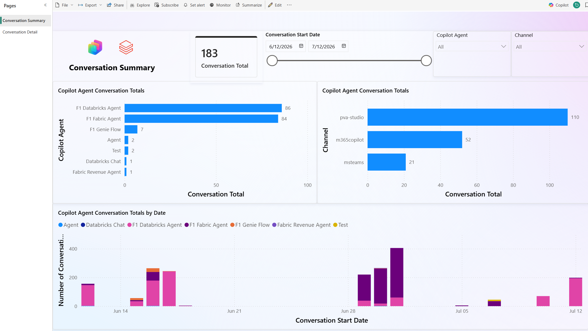
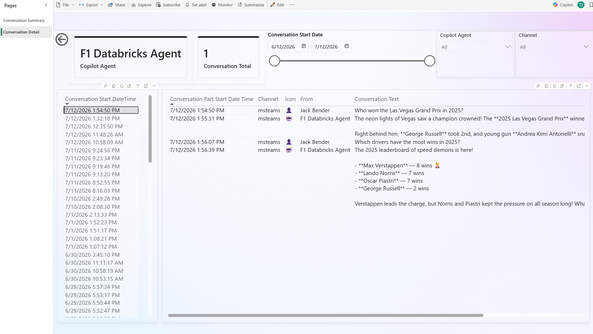
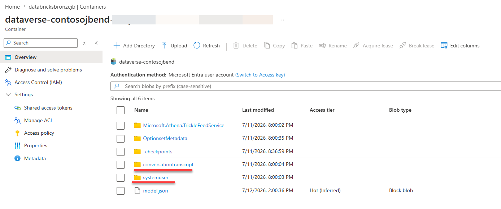
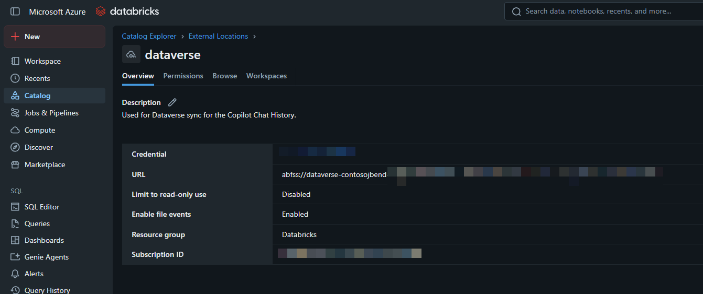

# Copilot Studio Agents - Conversation Chat History using Azure Databricks

## Overview
For many Copilot Studio makers and administrators, pulling conversation transcript data from Dataverse and navigating Application Insights and Azure Log Analytics can be challenging.

To address this, I created this repository, which allows you to easily view your Copilot Studio agent conversation history in a Power BI report with a Databricks SQL backend.

Below are sample screenshots of the report.

This repository is the next iteration of the [How to efficiently ingest Dataverse Common Data Model (CDM) tables with Databricks](https://community.databricks.com/t5/technical-blog/how-to-efficiently-ingest-dataverse-common-data-model-cdm-tables/ba-p/66671) article. For this solution, we use Unity Catalog and have Dataverse Synapse Link write to an ADLS Gen2 container that is recognized as an external location by Unity Catalog and use [Change Data Feed](https://learn.microsoft.com/en-us/azure/databricks/tables/features/change-data-feed) (CDF) on the Silver tables to only populate the incremental changes to the Gold table.

## Assets Contained in This Repo

### Databricks Notebooks
This repository contains the following notebooks that transform CSV files created by Dataverse Synapse Link through the medallion architecture so they can be consumed by the Power BI report.
#### Bronze to Silver  
- [CDM to Unity Catalog Auto Loader Ingestion](/src/Autoloader/CDM%20to%20Unity%20Catalog%20Auto%20Loader%20Ingestion.ipynb): This notebook incrementally ingests CDM (Common Data Model) entities exported from Dataverse as CSV files into Unity Catalog Delta tables using Auto Loader, with schemas derived from model.json and exactly-once processing guaranteed by checkpoints. It replaces a legacy blob-copy approach with a modern architecture that relies on UC External Locations for authentication and supports scheduled batch runs via trigger(availableNow=True).
#### Silver to Gold 
- [Conversations - Initial Ingestion](src/Autoloader/Conversations%20-%20Initial%20Ingestion.ipynb): This notebook performs an initial full-load ingestion from Silver to Gold: it reads Dataverse conversation transcripts, parses and flattens the nested JSON content into individual message rows, joins with system user data to enrich sender details, and writes the result as a managed Delta table to gold.copilot.conversations — storing the source version for subsequent incremental (CDF-based) loads.
- [Conversations - Incremental Load](src/Autoloader/Conversations%20-%20Incremental%20Load.ipynb): This notebook incrementally loads new conversation transcript records from a silver-layer source table using Delta Change Data Feed, applies transformations (JSON parsing, message extraction, user name resolution), and appends the results to a gold-layer target table while tracking the last-processed version for subsequent runs..

## Power BI Report
- [Copilot Chat History Report](src/PowerBI/Copilot%20Chat%20History%20-%20Databricks.pbix): This report contains two main pages:
    - **Conversation Summary Page**: A high-level dashboard showing overall conversation history for a specified time period. You can filter by individual Copilot Studio agent and communication channel. You can also drill through to any agent to see more details on the Conversation Detail page.
    - **Conversation Detail Page**: Displays individual conversations and shows the conversation history between users and the agent. 
NOTE: You will have to change the connection details of the report to point to your Databricks SQL Serverless compute.

## To get started, please perform the following:
1. Set up Dataverse Synapse Link to an Azure Data Lake for the following tables: **ConversationTranscript** (conversationtranscript) and **User** (systemuser). When finished, you should have a new container in Azure Data Lake that has a name beginning with "dataverse." For more information, see [Create an Azure Synapse Link for Dataverse with Azure Data Lake](https://learn.microsoft.com/en-us/power-apps/maker/data-platform/azure-synapse-link-data-lake).  
NOTE: Do not set up incremental ingestion when creating your Synapse Link.  
When finished, the root folder of your new container should look like the screenshot below.  &nbsp; 

2. Within Unity Catalog, create an external location that points to the newly created Azure Data Lake container from Step 1. For more information, see [Connect to an Azure Data Lake Storage Gen2 (ADLS Gen2) external location](https://docs.azure.cn/en-us/databricks/connect/unity-catalog/cloud-storage/external-locations-adls#external-location) 
When finished, your external location should look like the screenshot below.  &nbsp; 

3. Using Databricks Git Integration with Git folders, you can import these notebooks into your Databricks workspace. To do so, clone this repository to your GitHub environment and add your cloned repository via Git folders. For more on this procedure, see [Azure Databricks Git folders](https://learn.microsoft.com/en-us/azure/databricks/repos/).

4. To populate your silver tables, execute the [CDM to Unity Catalog Auto Loader Ingestion](/src/Autoloader/CDM%20to%20Unity%20Catalog%20Auto%20Loader%20Ingestion.ipynb).  
NOTE: Remember to change the notebook parameters to match the settings within your Databricks environment.

5. To populate your gold tables, execute the [Conversations - Initial Ingestion](src/Autoloader/Conversations%20-%20Initial%20Ingestion.ipynb).  
NOTE: Remember to change the notebook parameters to match the settings within your Databricks environment and **ONLY RUN THIS NOTEBOOK THE FIRST TIME**.

6. Once your gold tables are populated, you can append them using the [Conversations - Incremental Load](src/Autoloader/Conversations%20-%20Incremental%20Load.ipynb). 
NOTE: Remember to change the notebook parameters to match the settings within your Databricks environment.

7. Last but not least, you can create a Databricks job to run the following notebooks in succession: 
   [CDM to Unity Catalog Auto Loader Ingestion](/src/Autoloader/CDM%20to%20Unity%20Catalog%20Auto%20Loader%20Ingestion.ipynb) 
   [Conversations - Incremental Load](src/Autoloader/Conversations%20-%20Incremental%20Load.ipynb)

