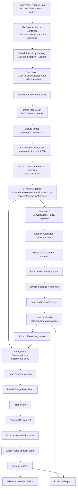

# Process Flow Diagram Source

This file contains Mermaid source for the repository process flow. Render it externally or in supported Markdown viewers.

```mermaid
flowchart TD
    A[Dataverse Synapse Link<br/>exports CDM tables to ADLS] --> B[ADLS dataflow-cdm container<br/>contains model.json + CSV partitions]

    B --> C[Databricks Unity Catalog<br/>External Location + Volume]
    C --> D[Notebook 1:<br/>CDM to Unity Catalog Auto Loader Ingestion]

    D --> D1[Read notebook parameters]
    D1 --> D2[Parse model.json<br/>build Spark schemas]
    D2 --> D3[Ensure target catalog/schema exist]
    D3 --> D4[Schema verification on conversationtranscript CSV]
    D4 --> D5[Auto Loader incremental ingestion<br/>CSV to Delta]
    D5 --> E[Silver layer tables<br/>silver.dataverse.conversationtranscript<br/>silver.dataverse.systemuser]

    E --> F[Notebook 2:<br/>Conversations - Initial Ingestion]
    F --> F1[Load conversation transcript data]
    F1 --> F2[Parse JSON content column]
    F2 --> F3[Explode conversation parts]
    F3 --> F4[Extract message-level fields]
    F4 --> F5[Load and join systemuser]
    F5 --> F6[Write Gold table<br/>gold.copilot.conversations]
    F6 --> H[Store cdf.baseline_version]

    E --> I[Notebook 3:<br/>Conversations - Incremental Load]
    H --> I
    I --> I1[Read baseline version]
    I1 --> I2[Read Change Data Feed]
    I2 --> I3[Filter inserts]
    I3 --> I4[Parse JSON content]
    I4 --> I5[Explode conversation parts]
    I5 --> I6[Extract fields and join users]
    I6 --> I7[Append to Gold]
    I7 --> I8[Advance baseline version]

    F6 --> J[Power BI Report]
    I7 --> J
```
